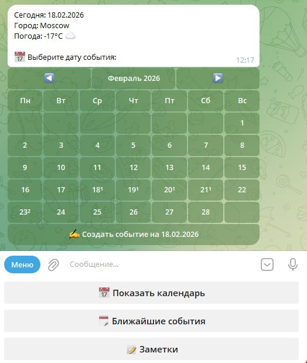

# tg_bot_clawd — quick start (EN)

Minimum steps, maximum result.

> Russian version: `README.ru.md`

## What it is

Telegram bot with calendar/notes + smart ingestion for:
- free-text commands (RU/EN),
- voice messages,
- PDF files,
- photos/posters.

It extracts events (date, time, description, address) and writes them to PostgreSQL.

---

## 1) Prerequisites

- Linux (Ubuntu/Debian)
- `python3`, `python3-venv`, `python3-pip`, `git`, `ffmpeg`
- PostgreSQL (local or remote)
- Telegram Bot Token from `@BotFather`
- Your Telegram ID (`tg_id`)
- **OpenClaw installed on the server** (used for smart processing)

---

## 2) Install system packages

```bash
sudo apt update
sudo apt install -y git python3 python3-venv python3-pip ffmpeg postgresql-client
```

If PostgreSQL is on the same host:

```bash
sudo apt install -y postgresql
```

Check OpenClaw:

```bash
openclaw --version
```

---

## 3) (Optional) create DB/user

```bash
sudo -u postgres psql
```

```sql
CREATE USER clawd_bot WITH PASSWORD 'ChangeMe_Strong_123!';
CREATE DATABASE clawd_bot OWNER clawd_bot;
GRANT ALL PRIVILEGES ON DATABASE clawd_bot TO clawd_bot;
\q
```

---

## 4) Clone project

```bash
git clone https://github.com/Ckobah/ClawPlanner ~/tg_bot_clawd
cd ~/tg_bot_clawd
```

---

## 5) Configure `.env` interactively

```bash
./scripts/configure.sh
```

You will be asked for:
- `TG_BOT_TOKEN`
- `ALLOWED_TG_IDS` (usually only your `tg_id`)
- `DB_HOST`, `DB_PORT`, `DB_NAME`, `DB_USERNAME`, `DB_PASSWORD`
- `WHISPER_MODEL`, `WHISPER_LANGUAGE`

---

## 6) One-command install + run

```bash
./scripts/install.sh
```

This script will:
- create `.venv`,
- install dependencies,
- run DB migrations,
- create `systemd --user` service `tg-bot-clawd.service`,
- start the service,
- configure reminder cron jobs.

---

## 7) Verify

```bash
./scripts/check.sh
systemctl --user status tg-bot-clawd.service --no-pager -n 30
journalctl --user -u tg-bot-clawd.service -n 50 --no-pager
```

---

## 8) Telegram smoke test

In `@your_bot`, test:
1. `/start`
2. `📅 Show calendar`
3. Text: `Create a meeting tomorrow at 15:00 about video content`
4. Voice message with an event
5. PDF/poster/ticket
6. Note text: `create note: buy a microphone`

### Main menu UI

After `/start`, the bot shows a bottom reply keyboard with three actions:
- `📅 Show calendar`
- `🗓 Upcoming events`
- `📝 Notes`

Expected behavior: after pressing `📅 Show calendar`, the bot sends a message with current date/weather and an inline calendar for day selection.



---

## 9) Auto-start after reboot

```bash
sudo loginctl enable-linger $USER
```

---

## 10) Update to latest version

```bash
cd ~/tg_bot_clawd
./scripts/update.sh
```

---

## 11) Manual restart

```bash
systemctl --user restart tg-bot-clawd.service
```

---

## Important

- If `LOCAL` is **not** set in `.env`, bot uses **PostgreSQL**.
- For single-user mode (no participants), keep only one ID in `ALLOWED_TG_IDS`.
- For high-quality smart extraction (PDF/posters/voice), OpenClaw must be available on the host.
